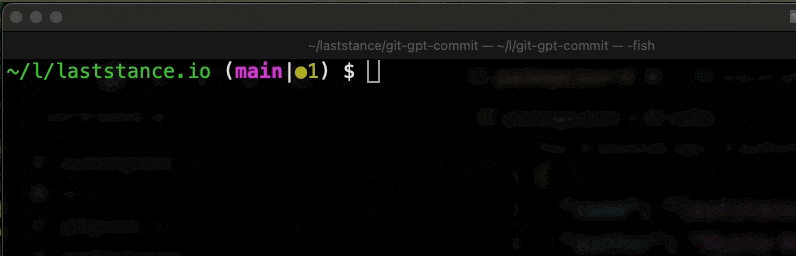

<h1 align="center">
    Git GPT Commit
</h1>

<br>


<p align="center">
    <code>An AI-powered Git extension</code> that generates commit messages using OpenAI's GPT-4o,  
    streamlining the commit process and improving developer productivity.
</p>

<br>

<p align="center">
  
</p>

<br>

📺 [Demo Video](https://www.youtube.com/watch?v=-0iVFHxXawo)
📖 [v0.9.0 Release Post](https://dev.to/malloc007/ive-just-released-git-gpt-commit-v090-13of)

## Installation

There are two ways to install the Git extension: using npm or manual installation.

- **Step1:** run the following command:

```bash
npm install -g @laststance/git-gpt-commit
```

- **Step2:** add your OpenAI API key using the `git gpt open-api-key`

```bash
git gpt open-api-key
```


----

Select `Add or update API key` from the menu and enter your API key when prompted. Your key will be securely stored in your user configuration.

- **Step3:** commit your changes with `git gpt commit`

```bash
git add --all
git gpt commit // generate commit message with AI
```

<p align="center">
    
</p>

✅ You've completed all setup!

### Available Commands

- **Commit with AI-generated message**

  ```bash
  git gpt commit
  ```

  Generates a commit message based on your staged changes.

- **Select AI Model**

  ```bash
  git gpt model
  ```

  Choose from available models (gpt-4o, gpt-3.5-turbo-instruct, gpt-4-turbo, gpt-4).

- **Change Commit Message Language**

  ```bash
  git gpt lang
  ```

  Select the language for commit messages (English, Spanish, Japanese, French, German, Italian, Korean, Chinese, Dutch, Russian, Portuguese).

- **Toggle Commit Prefix**

  ```bash
  git gpt prefix
  ```

  Enable/disable conventional commit prefixes (feat:, fix:, chore:, etc.).

- **Manage OpenAI API Key**

  ```bash
  git gpt open-api-key
  ```

  Add, update, display, or delete your stored OpenAI API key.

- **Show Current Configuration**
  ```bash
  git gpt config
  ```
  Display your current settings (model, language, prefix status, API key).

### Configuration

Your settings are stored in `~/.git-gpt-commit-config.json` and automatically loaded when you use the extension. You can manage your configuration through the commands above or directly edit this file.

## Credits

> Original package doesn't work due to config mistake 'package.json'. https://github.com/nooqta/git-commit-gpt  
> Therefore I fix it and added some features as a '@laststance/git-gpt-commit'.

Thanks to

- Author of [original package](https://github.com/nooqta/git-commit-gpt)

## License

This project is licensed under the MIT License.
